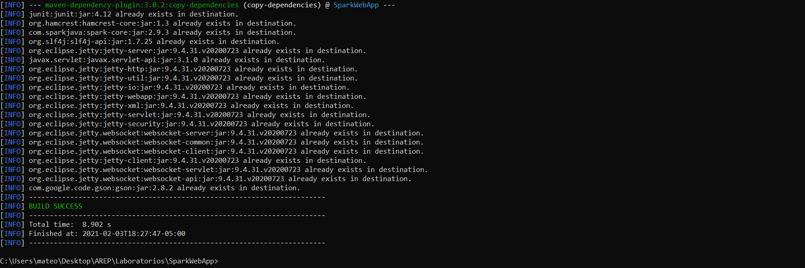
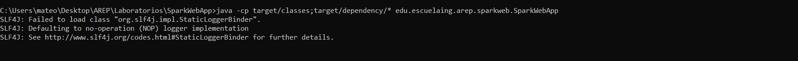
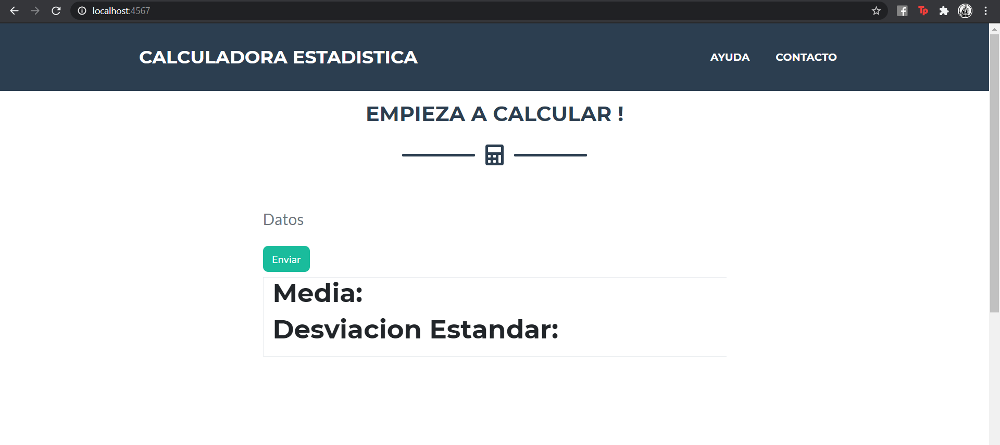
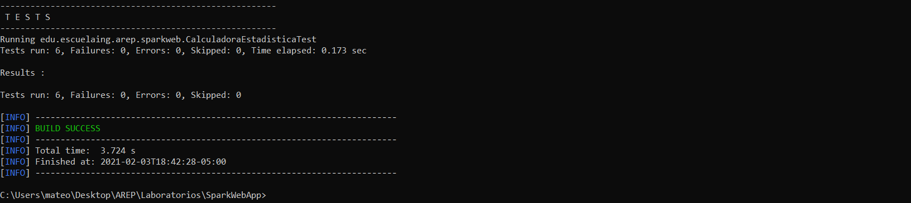

# TallerHeroku _ SparkWeb

Aplicativo Web diseñado en Java haciendo uso del framework Spark con el propósito de calcular la media y la desviación
estándar de un grupo de n datos que serán ingresados por el usuario vía web, la estructura de datos utilizada es una
implementación de una Lista Enlazada, y para la gestión de peticiones ajax se utiliza la librería js axios.

## Información Del Proyecto

* La documentación del las clases y los metodos del proyecto se encuentran en el directorio adjunto /Javadoc/apidocs.

* Haga click [aqui](Reporte_Taller1AREP.pdf) para ver el reporte del proyecto.

### Pre-Requisitos

Para correr este proyecto necesita los siguientes programas instalados, se adjuntan los
links de como descargarlos:
> - [Como Instalar Java 8](https://www.java.com/es/download/)
> - [Como Instalar Apache Maven](http://maven.apache.org/download.html#Installation)

Adicionalmente se recomienda tener descargado los siguientes programas:
> - [Como Instalar Git](http://git-scm.com/book/en/v2/Getting-Started-Installing-Git)
> - [Como Instalar HerokuCli](https://devcenter.heroku.com/articles/heroku-cli#download-and-install)

### Despliegue en Heroku
[](https://fast-tor-09008.herokuapp.com/)
### Calidad del código
[](https://www.codacy.com/gh/Candres1019/TallerHeroku/dashboard?utm_source=github.com&amp;utm_medium=referral&amp;utm_content=Candres1019/TallerHeroku&amp;utm_campaign=Badge_Grade)
### Integración Continua
[](https://app.circleci.com/pipelines/github/Candres1019/TallerHeroku)

### Instalación

1. Clonación o Descarga del Proyecto:

    - Para **Clonar** el proyecto utilice el siguiente comando en la ventana de comandos:
       ```
       git clone https://github.com/Candres1019/TallerHeroku.git
       ```
    - Para **Descargar** el proyecto de click [aquí](https://github.com/Candres1019/TallerHeroku/archive/main.zip),
      la descarga comenzara de manera automática.

2. En una ventana de comandos ejecute el siguiente comando, dentro de la carpeta del proyecto:
    ```
    mvn package
    ```
   Sabremos que todo salio bien, si vemos en consola lo siguiente:
   
   
3. Para ejecutar la aplicación de manera local utilizamos en la ventana de comandos el siguiente comando:
    > * Distribuciones Linux:
    > ```
    > java $JAVA_OPTS -cp target/classes:target/dependency/* edu.escuelaing.arep.sparkweb.SparkWebApp
    > ```
    > * Distribuciones Windows:
    > ```
    > java -cp target/classes;target/dependency/* edu.escuelaing.arep.sparkweb.SparkWebApp
    > ```
   Con esto podremos ver que la aplicacion esta corriendo de manera local:
   

4. Para ver el aplicativo web de manera local ingresamos al siguiente enlace:
    > ```
    > http://localhost:4567/
    > ```

   Veremos que el aplicativo ya se está ejecutando localmente:
    

5. Por defecto se creó la documentación JavaDoc y fue dejada en el directorio /Javadoc, si desea generar uno nuevo
   utilice el siguiente comando, esta documentación quedará en el directorio /target/site/apidocs :
   ```
    mvn javadoc:javadoc
    ```
## Ejecución de pruebas

En una ventana de comandos, utilice el siguiente comando:
   ```
    mvn test
   ```
Si todo sale de manera correcta debería ver esto en su ventana de comandos:


Estas pruebas están hechas para asegurar el correcto funcionamiento del cálculo de la media y desviación estándar,
estos cálculos fueron previamente hechos en libros de estadística y fueron utilizados para asegurar la veracidad de
los mismos, adicionalmente el programa está diseñado para tener una precisión de 2 decimales.

## Construido Con

* [Java 8](https://www.java.com/es/) - Lenguaje de Programación.
* [JUnit](https://junit.org/junit5/) - Pruebas de Unidad.
* [Maven](https://maven.apache.org/) - Manejo de dependecias.
* [Spark](https://sparkjava.com/) - Framework Web.

## Authors

* **Andres Mateo Calderón Ortega** - [Candres1019](https://github.com/Candres1019)

# Licencia
Este proyecto está licenciado bajo la GNU v3.0 - ver el archivo [LICENSE.md](https://github.com/Candres1019/Taller1-AREP/blob/main/LICENSE) para más detalles